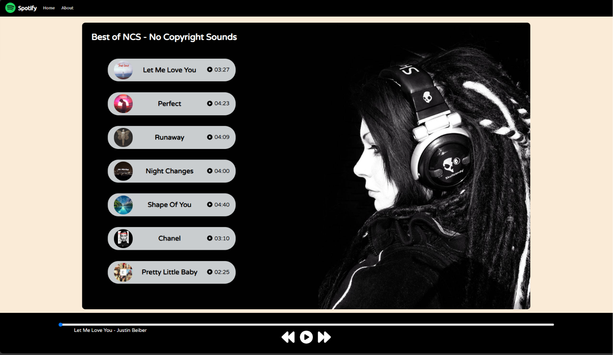
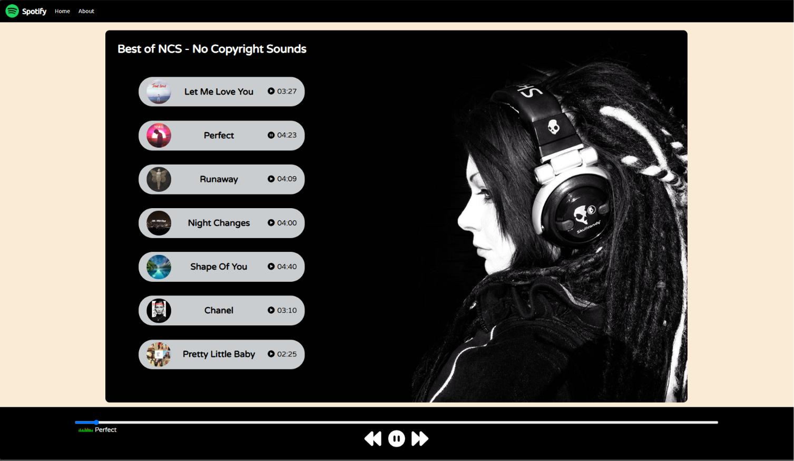

# 🎵 Spotify Clone

A responsive Spotify-inspired music player built using **HTML, CSS, and JavaScript**. This project was developed for learning and portfolio purposes to improve frontend development skills.

---

## 📸 Preview


---

## ✨ Features

- 🎧 Music player interface
- 📱 Responsive design
- 🎨 Modern Spotify-inspired UI
- ⏯️ Play/Pause functionality
- 📂 Clean and organized project structure

---

## 🛠️ Technologies Used

- HTML5
- CSS3
- JavaScript

---

## 🚀 Getting Started

1. Clone this repository

   ```bash
   git clone https://github.com/jeel-9414/spotify-clone.git
   ```

2. Open the project folder.

3. Run `index.html` in your preferred web browser.

---

## 📁 Project Structure

```text
spotify-clone/
│── index.html
│── style.css
│── script.js
│── logo.png
│── bg.jpg
│── cover1.jpg
│── ...
```

---

## 📌 Disclaimer

This project is an independent educational clone inspired by Spotify.

It is **not affiliated with, endorsed by, or associated with Spotify**.

---

## 📜 Copyright

© 2026 Jeel Panchal. All rights reserved.

This repository is shared for educational and portfolio purposes only. Unauthorized copying, redistribution, or commercial use without prior written permission is prohibited.
